# Getting started

## Install Visual Studio extension

The extension can be installed by double clicking on TorizonVSExtension.vsix, but you have to check that the following applications are installed on your Windows 10 PC:

- Visual Studio 2017 Version 15.9 (this is the version used to develop and test the extension)
  - You can download community edition [here](https://visualstudio.microsoft.com/downloads/) or you have to install Visual Studio 2017 Professional if your company/project don't match the requirement for community version.
  - Visual C++ for Linux Development extension (if you didn't install it you can add it by launching Visual Studio Installer and modifying your current setup)
- Docker for Windows, you can use community edition downloadable [here](https://store.docker.com/editions/community/docker-ce-desktop-windows)
  - Linux containers must be enabled in the configuration, this is the default option

To check that the extension has been successfully installed you can open the extension list under "Tools\Extensions and Updates..." as in the following screenshot.  
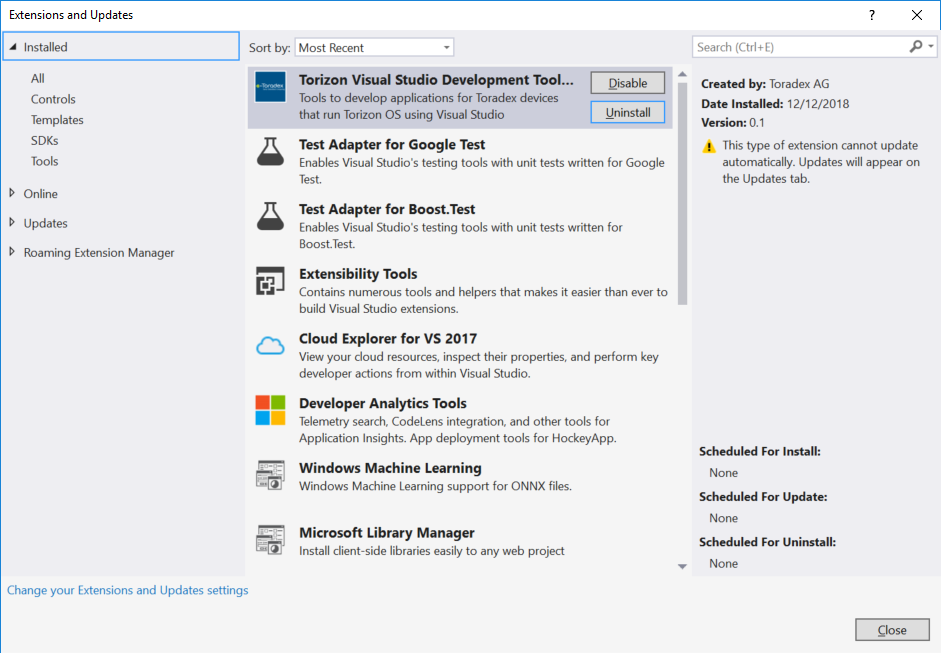  

## Install Torizon on your device

This extension supports application development for [Torizon](https://labs.toradex.com/projects/torizon), so you have to install it on a compatible Toradex module, as documented [here](https://github.com/toradex/toradex-torizon-manifest).  
Application developed by this extension are delivered as containers, so you need to install the torizon-core-docker variant of Torizon.  
Instruction assume that you are using the Toradex Colibri/Apalis EVB, but you'll just need a connection to the serial console or over network, so this may be easily adapted to other carrier boards.

## Configure Visual Studio Environment

The exension provides some windows and toolbars but they are hidden by default, you can enable them to make Torizon related features more accessible inside the IDE.

### Add devices

You can show the device list by selecting the "Torizon devices" option under the "View\Other Windows" menu of Visual Studio.  
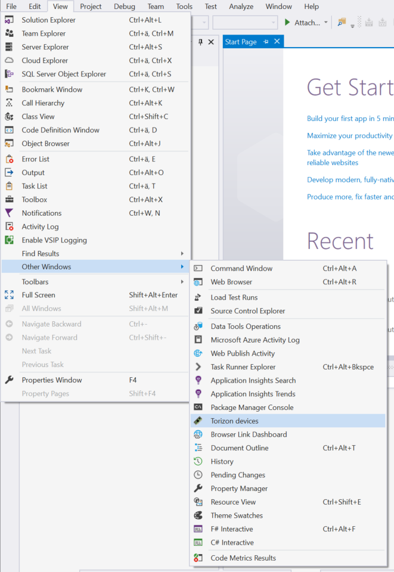  

You will see a new tool window named "Torizon Devices" that contains a toolbar on top.  

You will be able to pin the list inside the IDE as any other tool window in Visual Studio.

The device list will be empty on first execution of the tool but if you have a Torizon device connected to your PC via serial port or network you will be able to add it to the list.  


#### Add serial device

If you have a Toradex EVB you can connect UARTA of your module via serial connector or via the FTDI USB to serial converter that is on the board, this can be configured using jumpers, please check reference manual of your EVB to get specific information.  

By clicking on the serial port icon you will be able to select the serial port and insert the credentials that will be used to configure the device over serial console. Username "torizon" and password "torizon" should work on a freshly installed image of Torizon.  
  

#### Add network device

To add device over network you need to know it's IP address or hostname.  
The tool will open an SSH connection to the device and configure it to support application deployment. You will be asked to provide username and password for connection, "torizon" as both username and password will work on freshly installed default images.
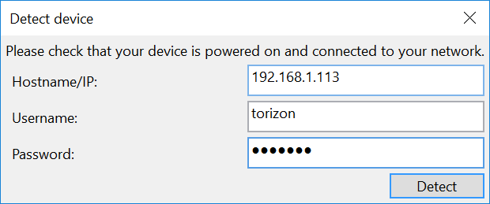

### Devices list

After you added new devices in the way described in the previous step you should see them appearing in the devices list.  
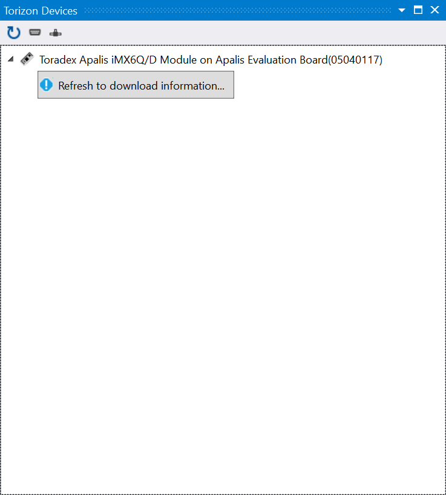  
By default information is not read from devices at startup (this may require some time with many configured devices), but you can use the refresh button to collect it.  
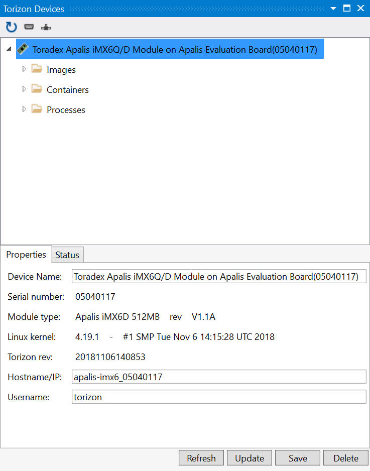  
The devices list will allow you to see information about your devices and container and processes running on them. You can also use it to stop containers and delete container images and this will be useful after some experimentation because space for containers images on your target may fill-up quite quickly.

### Torizon toolbar

You will need some specific commands to build your Torizon applications, those will be added to the relevant Visual Studio menus, but it could be handy to have them available inside the main Visual Studio toolbar. To enable Torizon toolbar you can select "Tools\Customize..." from Visual Studio main menu, this will open the customization dialog and in the "Toolbars" tab you can select "Torizon Toolbar".
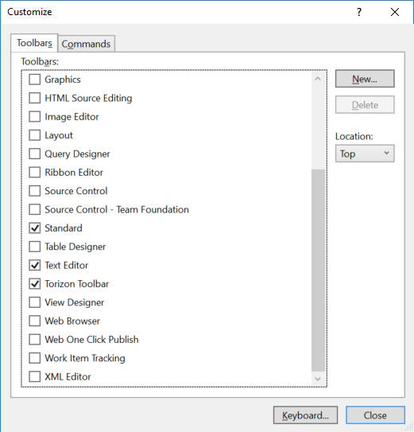  
This will enable the toolbar with torizon specific commands.  
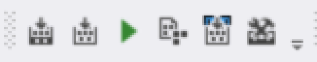

### Download base images

The tools uses some docker containers to build the code and the images you will run on your target, if the container is not already available it will be downloaded the first time you try to run or build it. Since this may take some time you may want to download all the container images you may need before you start creating new applications. To do this just select the "Download/update sdk and base containers" from the Tools menu of Visual Studio.

## Create a new application

You can create a new Torizon application by selecting "File\New\Project..." on Visual Studio main menu. This will show the new project wizard.  
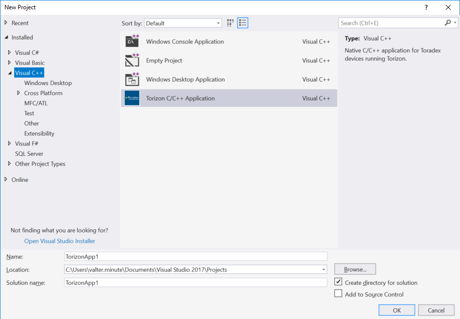  
You should select "Torizon C/C++ Application" under the Visual C++ category.  
Next step will be selecting which platforms you want to use to run your application. Platforms are base container images, providing different sets of features.  
Currently 3 platforms are provided:

- Debian Buster slim is a headless minimal configuration of debian buster, good to run applications with no graphic UI or not using X, this is the platform you should select to build the first small sample application.
- Debian LXDE Buster - is a full desktop environment
- Debian Xorg Buster - is a smaller GUI image that includes only the X server

Each platform has also a version number, allowing you to target different versions of the same base platform.  

You can select multiple platforms in the list, and this will generate multiple configurations of your application. For the fist stample you can just select "Debian buster slim".  
After a short wait the new project will be opened in the Visual Studio IDE.  
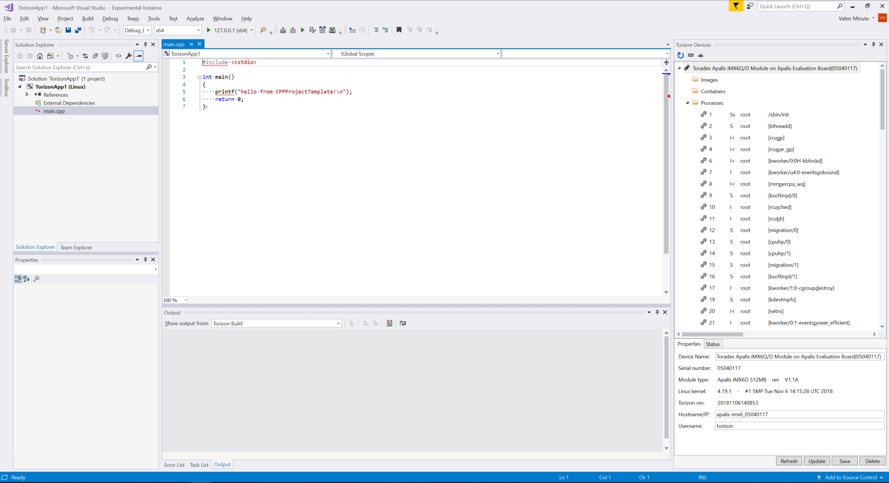  

## Build application

You can select the "Build\Build Torizon Application" option in the Visual Studio main menu (or the corresponding option in the Torizon toolbar) to build your application.  
First time you do this the operation will require some time. What is happening under the hood is quite complex and require some container-related operations:

- The application container will be built
- An SDK container will be created, copying headers and libraries from the application container
- SDK container is started and Visual Studio finally builds your code inside it

If the build process has been completed successfully you are ready to debug your code on the target device.

## Deploy and debug application

You can open your source code and put a breakpoint inside it to test debugger features.  
Then you can select "Debug\Deploy and debug Torizon application" from Visual Studio main menu (or click the corresponding button inside the Visual Studio Toolbar).  
You'll be prompted to select a device to deploy your application.  
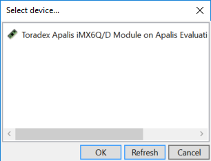  
First time you deploy a new application you'll have to deploy and start also the associated container, this may take a few minutes, the operation will be needed only if you change the container image (we will see how to do it later in this tutorial), so you won't have to wait such a long time if you just changed and rebuilt your own application.  
If you see no errors, your application will be started and the debugger will hit the breakpoint you set.  
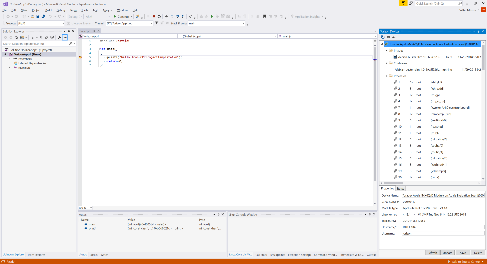  
If you refresh the device list you could see that a new container image has been deployed on your device (each application is given a unique ID) and that an instance of it is running. Your application is actually running inside the container, as you can see by inspecting the list of processes for that container.  
You can use all Visual Studio debugging commands to run your code, add breakpoints, inspect variables etc.  
If you don't want to select the target device every time you deploy your application you can select project properties by selecting "Project\Properties" from Visual Studio main menu. This will open the project properties dialog.  
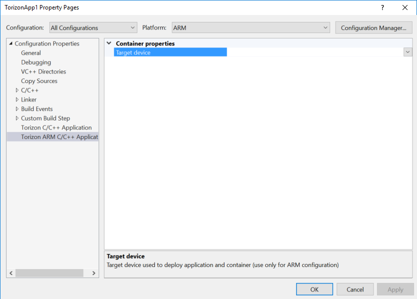  
Check that ARM platform is selected in the combo box on the top and then click "Torizon ARM C/C++ Application" category. Clicking on the device field and then on "<Device...>" you will see the device selection dialog again, selecting a device there will make the selection permanent, so your application will always be deployed on that device, without asking at every startup.

## Adding additional libraries and access hardware

This is a second step in the tutorial, to do it you need to create a new application, as described in the previous chapters, and select root as the user executing the application inside your container. In this step we will use libsoc to acces hardware on our device. This will show how to add libraries and use them inside your code and also how to run an application as root inside the container, giving it full access to the resources that the OS makes accessible to it.  
To access hardware we are going to use [libsoc](https://github.com/jackmitch/libsoc) that is a library that provide a portable API to access GPIO, I2C, SPI and PWM on a device.  
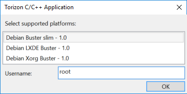
Before you start building your application you need to configure some properties to add additional libraries to our application container image.  
Select "Project\Properties" from Visual studio main menu and check that "All Configurations" and "All Platforms" are selected in the combo box on the top of the project properties dialog.
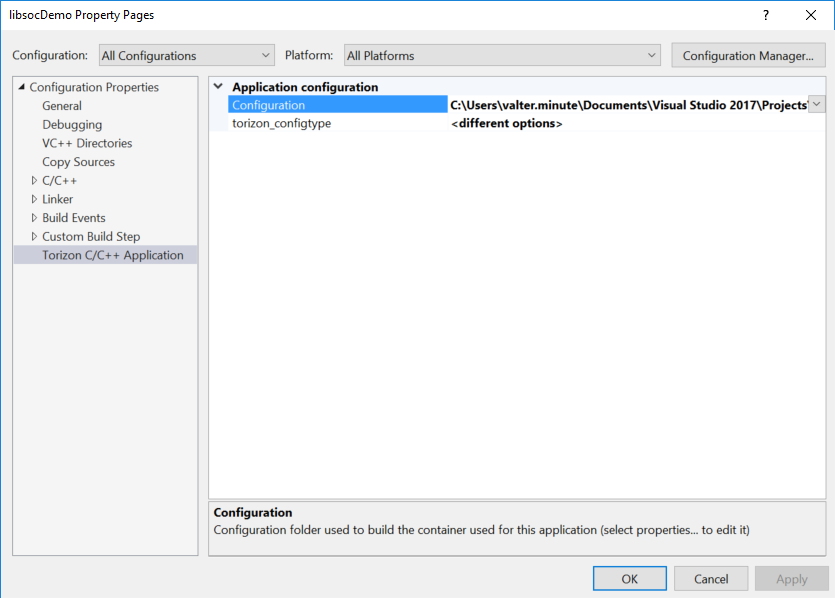
Click on the "Configuration" line and then on "<Properties...>", this will open the application configuration dialog.  
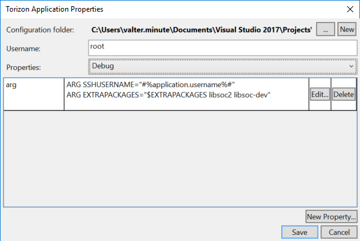
You can press the "Edit.." button in the "arg" line and add the following text (on a new row):

```dockerfile
ARG EXTRAPACKAGES="$EXTRAPACKAGES libsoc2 libsoc-dev"
```

This will add both the libsoc runtime and the include/library files needed to build application using it (the "-dev" package).  
We also need to add libsoc to the libraries linked when our application is built.  
To do this you should move to the "Linker\Input" category in the project properties dialog and add "soc" to the "Library Dependencies" entry (lib prefix is added by default), as shown in the screenshot below.  
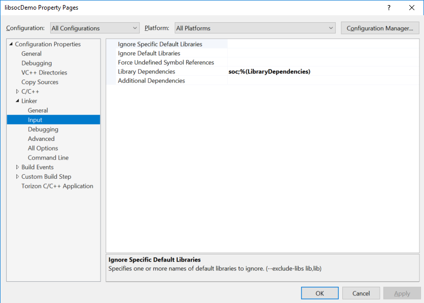  
To manage platform-specific IOs libsoc needs a configuration file describing the specific platform you are using. Those are not provided by the standard package, but you can download them from [github](https://github.com/jackmitch/libsoc/tree/master/contrib/board_files), as you can see, conf files for Toradex modules are provided.  
For example, if you are running your code on an apalis-imx6 module you can download [apalis-imx6.conf](https://github.com/jackmitch/libsoc/blob/master/contrib/board_files/apalis-imx6.conf) and put it in the same folder as your source code.  
You then have to add it to your project by selecting "Project\Add Existing Item..." from Visual Studio menu. Once you have added the file to your project you should right click on it and select "Properties..." this will open the "Property Pages" dialog.  
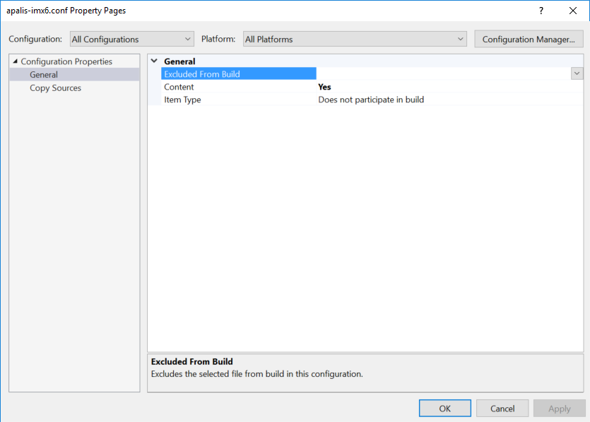
In the "General" category set the "Content" option to "Yes", then move to "Copy Sources" page.
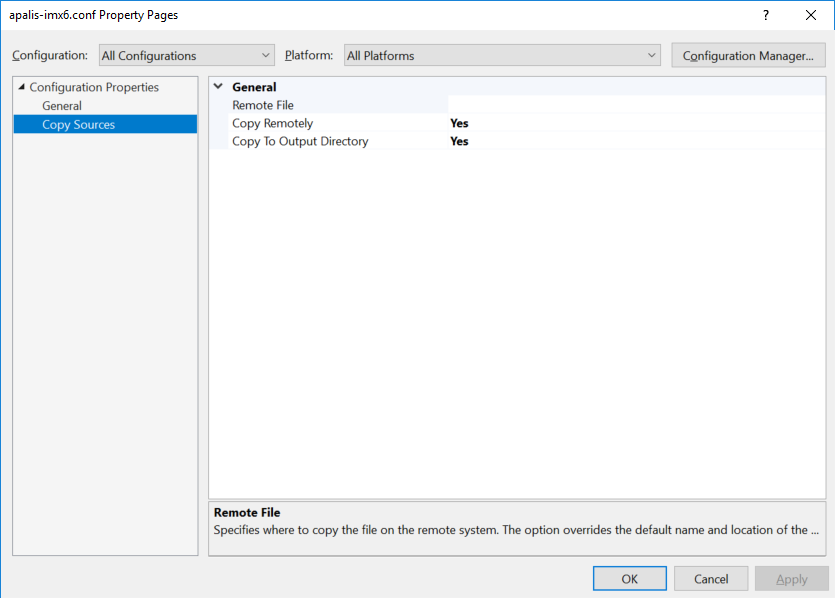
There you should set to "Yes" both "Copy Remotely" and "Copy To Output Directory".
This will grant that your configuration file is deployed to the target.  
  
At this point you can build your application for the first time.
This will generate both the container image and the SDK container, it will also update intellisense, so when you paste the code above in your main.cpp file (replacing its current content) you will see that the IDE highlight functions and shows parameters when you type an open bracket after a function name or press ctrl+space in the editor.

```cpp
#include <stdio.h>
#include <stdlib.h>
#include <unistd.h>
#include <libsoc_gpio.h>
#include <libsoc_board.h>

int main()
{
    board_config* config = NULL;
    gpio* ledgpio = NULL;
    int ledgpioid = -1;
    int state = 0;

    // we don't have /proc/device-tree mounted inside the container so 
    // we must configure conf file path in environment
    setenv("LIBSOC_CONF", "./apalis-imx6.conf", 1);
    config = libsoc_board_init();

    if (!config)
    {
        printf("Cannot load board configuration.");
        return -1;
    }

    ledgpioid = libsoc_board_gpio_id(config, "MXM3_7");

    if (ledgpioid == -1)
    {
        printf("Cannot convert required GPIO.");
        return -1;
    }

    ledgpio = libsoc_gpio_request(ledgpioid, LS_SHARED);

    if (ledgpio == NULL)
    {
        printf("Cannot acquire required GPIO.");
        return -1;
    }

    if (libsoc_gpio_set_direction(ledgpio, OUTPUT) == EXIT_FAILURE)
    {
        printf("Cannot configure GPIO as output.");
        return -1;
    }

    for (;;)
    {
        libsoc_gpio_set_level(ledgpio, state ? HIGH : LOW);
        state = state ? 0 : 1;
        sleep(1);
    }

    return 0;
}
```

Now you can build the application and deploy it again, you'll notice that build and deployment won't take too long, this is because the container image hasn't been changed and so it does not need to be rebuilt and re-deployed to the target.  
If you connect a jumper between MXM3_7 and LED1 on the EVB you should see the LED flashing when you run your application.  
If you use a different module you can check the corresponding .conf file to find a suitable pin name to use.  

## Known Issues ##

1. First build attempt of a new project may fail. This is due to the fact that a new instance of the SDK container needs to be created and this may take longer than the connection timeout supported by Visual Studio. Re-launching build command should fix the issue.
1. When using the debian-LXDE container application deployment may fail the first time you attempt it on a device where the container is not yet running. It takes some time before the container is fully started and ready to accept incoming connections. Usually re-executing the deploy operation should be enough to fix the issue.
