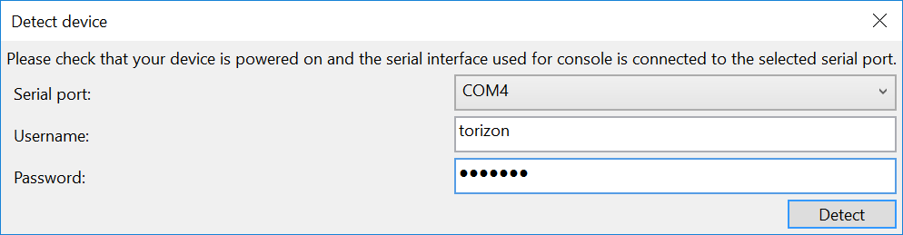

# Getting started

## Install Visual Studio extension

Install the extension by double clicking on TorizonVSExtension.vsix, check that the following applications are installed on your Windows 10 PC:

- Visual Studio 2017 Version 15.9 (used to develop and test the extension)
  - you can download the community edition [here](https://visualstudio.microsoft.com/downloads/) or install Visual Studio 2017 Professional if your company or project can't use the community version.
  - Visual C++ for Linux Development extension (if you haven't already installed it you can add it by launching the Visual Studio Installer and modifying your current setup)
- Docker for Windows, you can download the community edition [here](https://store.docker.com/editions/community/docker-ce-desktop-windows)
  - Linux containers must be enabled in the configuration. This is the default option

To check that the extension has been successfully installed, open the extension list under *Tools > Extensions and Updates...* as shown here.  
  

## Install Torizon on your device

This extension supports application development for [Torizon](https://labs.toradex.com/projects/torizon). To use it, you'll need to install it on a compatible Toradex module, as documented [here](https://github.com/toradex/toradex-torizon-manifest).  
Application developed with this extension are delivered as containers, so you'll need the torizon-core-docker variant of Torizon.  
These instructions assume that you are using the Toradex Colibri/Apalis EVB. However, since you only need a connection to the serial console and over network, this process may be easily adapted to other carrier boards.

## Configure the Visual Studio Environment

The exension provides some windows and toolbars but they are hidden by default. You can enable them to make Torizon-related features more accessible inside the IDE.

### Add devices

You can show the device list by selecting *View > Other Windows > Torizon devices* from the menu bar in Visual Studio.  
  

A new tool window named *Torizon Devices* will appear. If you wish, you will be able to pin the device list inside the IDE, as with any other tool window in Visual Studio.

The first time you use the tool, the device list will be empty. If you have a Torizon device connected to your PC via serial port or network you can add it to the list.  


#### Add a serial device

If you have a Toradex EVB you can connect to module's UART-A using either the serial connector or the FTDI USB to serial converter on the board. This can be configured using jumpers; please [watch this short video tutorial](https://www.youtube.com/watch?v=9IFUYdwotY8) or check your EVB's reference manual for specific.  

By clicking the serial port icon you can select the serial port and input the credentials needed to configure the device over the serial interface. the username "torizon" and password "torizon" should work on a freshly installed image of Torizon.  
  

#### Add a network device

To add a device over network, you need to know its IP address or hostname.  
The tool will open an SSH connection to the device and configure it to support application deployment. You will be asked to provide a username and password for the connection; the default on a freshly installed image is "torizon" as both the username and password.


### The device list

After addig new devices as described in the previous step you should see them in the devices list.  
  
By default information is not read from devices at startup (as this may require some time), but you can use the refresh button to collect it.  
  
The device list allows you to see information about your devices and the containers and processes running on them. You can also use it to stop containers and delete container images. After some experimentation, the space for containers images on your target may fill-up quite quickly, so you can use this feature to reclaim that space.

### The Torizon toolbar

You will need some specific commands to build Torizon applications. These commands will be added to the relevant Visual Studio menus, but you may find it convenient to have them available from the main Visual Studio toolbar as well. To enable the Torizon toolbar, select *Tools > Customize…* from Visual Studio’s menu bar. This will open the customization dialog. In the Toolbars tab, select "Torizon
Toolbar".
  
This will enable the toolbar with Torizon-specific commands.  


### Download base images

The tools uses some docker containers to build the code and the images you will run on your target. If the containers are not already available, they will be downloaded the first time you try to run or build them. Since this may take some time, you may want to download all the container images before you start creating new applications. To do this, select Tools > Download/update SDK and base containers from the menu bar.

## Create a new application

You can create a new Torizon application by selecting *File > New > Project…* from the menu. The New Project window will appear.  
  
Select *Torizon C/C++ Application* from the *Visual C++* category.  
Next, select the platforms you want to use to run your application. Platforms are base container images which provide different sets of features.  
Currently, three platforms are available:

- Debian Buster Slim is a headless, minimal configuration of Debian Buster. It’s good for running applications with no GUI (including X). Select this platform to build the first small sample application.
- Debian LXDE Buster is a full desktop environment.
- Debian Xorg Buster is a smaller GUI image that includes only the X server.

Each platform has also a version number, allowing you to target different versions of the same base platform.  

You can select multiple platforms in the list to generate multiple configurations of your application. For the first sample, Debian Buster Slim is fine.  
After a moment, the new project will appear in Visual Studio.  
  

## Build an application

Select *Build > Build Torizon Application* from the menu bar (or the corresponding option in the Torizon toolbar) to build your application.  
Building an application for the first time may take a while: what is happening under the hood is complex, involving some container-related operations:

- The application container will be built.
- An SDK container will be created by copying headers and libraries from the application container.
- The SDK container will be started, and Visual Studio will build your code inside it.
If the build process is successful, you can begin debugging your code on the target device.

## Deploy and debug an application

You can put a breakpoint in your source code to test debugger features.  
After doing so, select Debug > Deploy and debug Torizon application from the menu bar, or click the corresponding button in the Visual Studio toolbar.  
You'll be prompted to select a device on which to deploy your application.  
  
The first time you deploy a new application, you'll also need to deploy and start the associated container, which may take a few minutes. Thereafter, this operation will only be necessary if you change the container image (discussed later in this tutorial), so you won't have to wait a long time when changing and rebuilding your own application.  
If you see no errors, your application will run, and the debugger will hit the breakpoint you set.  
  
If you refresh the device list, you’ll see that a new container image has been deployed on your device (each application is given a unique ID) and that an instance of it is running. Your application is actually running inside the container, as you can see by inspecting the list of processes for that container.  
You can use all Visual Studio debugging commands to run your code, add breakpoints, inspect variables, etc.  
If you don't want to select the target device every time you deploy your application, you can set it in the project properties, by selecting *Project > Properties* from the menu bar. This will open the project’s properties dialog.  
  
Check that the ARM platform is selected in the drop-down box at the top, and then select the *Torizon ARM C/C++ Application* category from the list to the left. Click the Target device field, and then click "". When the device selection dialog appears, select a device. From that point on, your application will always be deployed on that device.  

## Adding additional libraries and access hardware

This is a separate part of the tutorial. For it, you’ll need to create a new application, as described previously. Select root as the user that will execute the application inside your container.  
In this section, we will use libsoc to access a device’s hardware. This will show you how to add libraries and use them in your code. You’ll also learn how to run an application as root inside the container, giving the application full access to the resources made available by the OS.  
The [libsoc](https://github.com/jackmitch/libsoc) library provides a portable API to access GPIO, I2C, SPI and PWM on a device.  
  
Before you start building your application, you’ll need to configure some properties to add additional libraries to the application container image.  
Select *Project > Properties* from the menu bar, and check that All Configurations and All Platforms are selected in the drop-down boxes above the main view.  

Click the *Configuration* entry, and then click "". This will open the application configuration dialog.  

Click *Edit…* to the right of the arg entry, and add the following text on a new line:

```dockerfile
ARG EXTRAPACKAGES="$EXTRAPACKAGES libsoc2 libsoc-dev"
```

This will add the libsoc runtime, as well as the include/library files needed to build applications with it (the "-dev" package).  
We also need to add libsoc to the libraries linked when the application is built.  
To do so, navigate to the Linker > Input category in the project properties dialog, and add "soc" to the Library Dependencies entry (the “lib” prefix is added automatically), as shown below.  
  
To manage platform-specific I/Os, libsoc needs a configuration file describing the platform you’re using. These are not provided by the standard package, but you can download them from [github](https://github.com/jackmitch/libsoc/tree/master/contrib/board_files). You’ll find that .conf files for Toradex modules are provided.  
For example, if you’re running your code on an Apalis iMX6 module, you can download [apalis-imx6.conf](https://github.com/jackmitch/libsoc/blob/master/contrib/board_files/apalis-imx6.conf) and put it in the same folder as the source code.  
Then, add it to your project by selecting *Project > Add Existing Item…* from the menu bar. After adding the file to your project, right-click it and select *Properties…* to open its property  
  
In the *General* category, set *Content* to "Yes". Then, switch to the *Copy Sources* category.  

Set both *Copy Remotely* and *Copy To Output Directory* to “Yes”. This will cause your configuration file to be deployed to the target.  
Now, you can build your application for the first time. This will generate both the container image and the SDK container. It will also update IntelliSense, so when you paste the code below into your main.cpp file (replacing its current contents), you will see that the IDE highlights functions and shows parameters when you type an open bracket after a function name or press Ctrl + Space in the editor.  

```cpp
#include <stdio.h>
#include <stdlib.h>
#include <unistd.h>
#include <libsoc_gpio.h>
#include <libsoc_board.h>

int main()
{
    board_config* config = NULL;
    gpio* ledgpio = NULL;
    int ledgpioid = -1;
    int state = 0;

    // we don't have /proc/device-tree mounted inside the container so 
    // we must configure conf file path in environment
    setenv("LIBSOC_CONF", "./apalis-imx6.conf", 1);
    config = libsoc_board_init();

    if (!config)
    {
        printf("Cannot load board configuration.");
        return -1;
    }

    ledgpioid = libsoc_board_gpio_id(config, "MXM3_7");

    if (ledgpioid == -1)
    {
        printf("Cannot convert required GPIO.");
        return -1;
    }

    ledgpio = libsoc_gpio_request(ledgpioid, LS_SHARED);

    if (ledgpio == NULL)
    {
        printf("Cannot acquire required GPIO.");
        return -1;
    }

    if (libsoc_gpio_set_direction(ledgpio, OUTPUT) == EXIT_FAILURE)
    {
        printf("Cannot configure GPIO as output.");
        return -1;
    }

    for (;;)
    {
        libsoc_gpio_set_level(ledgpio, state ? HIGH : LOW);
        state = state ? 0 : 1;
        sleep(1);
    }

    return 0; 
}
```

After doing so, build the application and deploy it again. You'll notice that the process doesn’t take as long — this is because the container image hasn’t been changed, so it doesn’t need to be rebuilt and re-deployed to the target.  
If you connect a jumper between MXM3_7 and LED1 on the EVB, you should see the LED flashing when you run your application. If you’re using a different module, you can check the corresponding .conf file to find a suitable pin name to use.  

## Known issues ##

1. The first build attempt of a new project may fail. This is due to the fact that a new instance of the SDK container needs to be created, which may take longer than the connection timeout supported by Visual Studio. Issuing the build command again should fix the issue.
1. When using the debian-LXDE container, application deployment may fail the first time you attempt it on a device where the container is not yet running. It takes some for the container to fully start up and begin accepting incoming connections. Usually, retrying the deploy operation is enough to fix the issue.